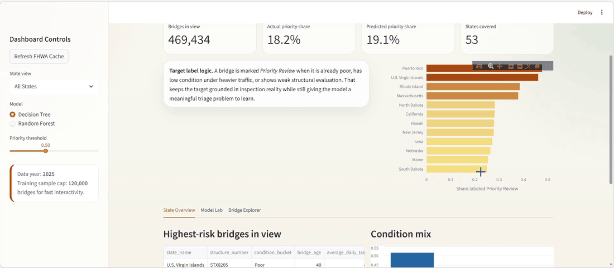
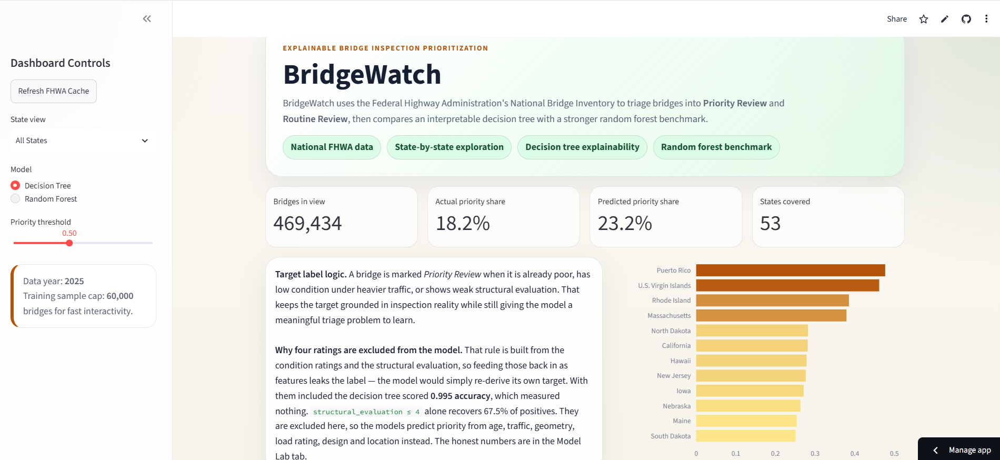
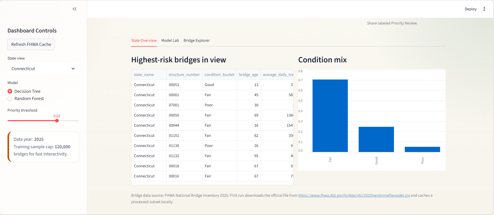
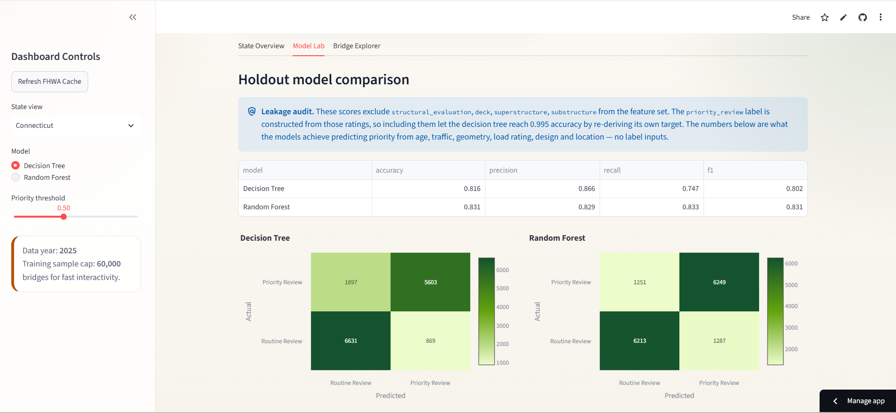
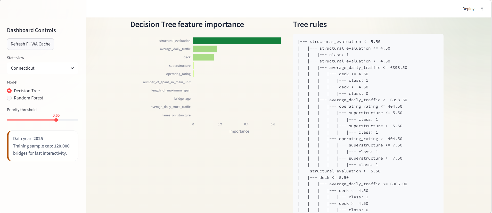
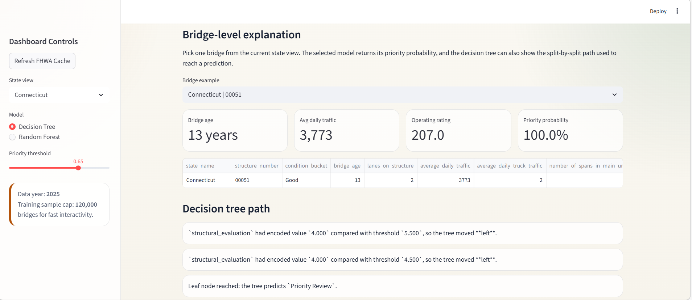

# BridgeWatch

Interactive infrastructure analytics dashboard for triaging bridge inspection priority across the U.S. bridge inventory.

## Demo



Full recording: [View the demo video](assets/media/demo-recording.mp4)

## Overview

BridgeWatch is a Streamlit dashboard built around the Federal Highway Administration's National Bridge Inventory. It helps users explore bridge condition patterns, compare tree-based models, and inspect bridge-level explanations for why an asset is flagged for closer review.

The app helps users:

- filter the national bridge inventory by state
- compare an interpretable decision tree with a random forest benchmark
- review bridges with the highest predicted inspection priority
- inspect feature importance and tree rules
- walk through bridge-level predictions with an explainable path view

## Product Highlights

- National bridge data workflow with state-by-state exploration
- Decision Tree and Random Forest comparison in one focused interface
- Bridge-level explanation panel for interpretable triage decisions
- Clean dashboard layout with media assets ready for GitHub presentation

## Model Approach

BridgeWatch frames the problem as **Priority Review** versus **Routine Review** using inspection-relevant bridge attributes from the National Bridge Inventory.

The modeling workflow includes:

- a `DecisionTreeClassifier` for interpretable split logic
- a `RandomForestClassifier` for a stronger ensemble benchmark
- numeric and categorical preprocessing through a scikit-learn pipeline
- feature importance and confusion matrix views for model inspection

## Inputs

The dashboard uses bridge inventory and inspection attributes such as:

- state and bridge identifier
- bridge age and structure dimensions
- average daily traffic and truck traffic
- deck, superstructure, and substructure condition ratings
- structural evaluation and operating rating
- design load, material/design category, and service type

## Screenshots

### Dashboard Overview



### State Overview



### Model Lab



### Tree Rules



### Bridge Explorer



## Data Source

BridgeWatch uses the FHWA National Bridge Inventory and caches a processed dataset locally after the first successful run.

Reference pages:

- [FHWA National Bridge Inventory downloads](https://www.fhwa.dot.gov/bridge/nbi/ascii2025.cfm)
- [FHWA NBI record format](https://www.fhwa.dot.gov/bridge/nbi/format.cfm)

## Run Locally

```bash
pip install -r requirements.txt
streamlit run app.py
```

On first run, the app downloads the official FHWA bridge file and builds a processed cache locally.

## Repo Structure

- `app.py` - Streamlit dashboard interface
- `src/constants.py` - data paths, FHWA source configuration, and field metadata
- `src/data.py` - download, parsing, cleaning, and feature engineering pipeline
- `src/modeling.py` - model training, metrics, feature importance, and prediction helpers
- `src/visuals.py` - charts for confusion matrices, state summaries, and feature importance
- `assets/media/` - demo GIF and full recording
- `assets/screenshots/` - README screenshots

## GitHub Description

Interactive dashboard for explainable bridge inspection prioritization using tree-based machine learning.
